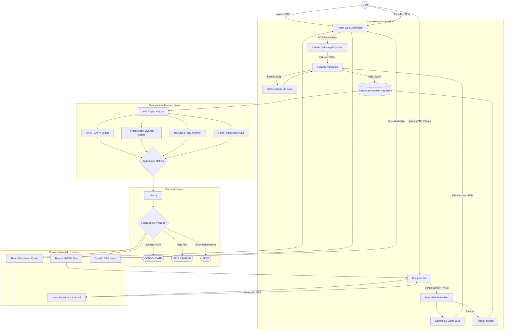

# Complete System Architecture (FinMentor AI & ArthaScan)

This document provides a high-level visual and structural breakdown of the entire unified ecosystem (Web Dashboard & Telegram Bot). The core philosophy is **"Zero-Hallucination Finance,"** strictly isolating all mathematical and business logic from the generative AI models, while providing multiple interfaces.

## 1. Top-Down Visual Flow

### Color Guide / Legends
- **Purple / Cloud logic:** Non-deterministic generative LLMs (Claude/Gemini).
- **Teal / Local nodes:** Pure Python, 100% deterministic algorithms.
- **Red / Fallbacks:** Silent fail-safe mechanisms avoiding API drops.

---

## 2. Component Explanations

### Phase 1: Multimodal Data Extraction
Standard text-crawlers routinely mangle complex mutual fund statement tables. To fix this, we employ a multimodal approach:
- **Telegram Bot:** Uses `PyMuPDF` to rasterize PDFs into images, feeding them to **Gemini 2.5 Flash Vision**. 
- **Web App:** Uses **Claude Vision** combined with `pdfplumber`.
Both pathways force the LLM outputs through strict **Pydantic Validation**. If syntax breaks from the LLM, a self-healing loop repairs the payload before proceeding.

### Phase 2: The "Zero-Hallucination" Sandbox
LLMs are banned from doing math. The validated structured data is passed into pure Python deterministic engines:
- **XIRR & Tax:** Exact `XNPV` computations and Tax regime matching.
- **Overlap & Bleed:** Individual stock intersection mapping and 10-Year TER erosion calculations against index baselines.

### Phase 3: Rigid Decision Hierarchy & UI
Aggregated financial truths trigger an absolute Rules Engine, rendering outputs to users either via a highly animated React unified dashboard, or an instant actionable message + PDF payload via Telegram. 

### Phase 4: Conversational Chat Guard
The "Ask AI" conversational layers are forced to route through Chat Guards referencing *only* the computed math dictionary, effectively translating concrete mathematical JSON truths into fluid English or Hinglish without hallucinations. 
